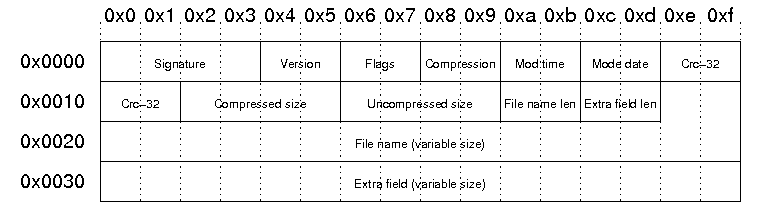
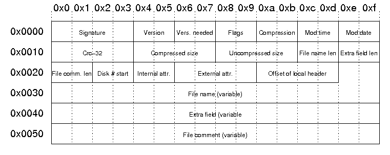

## Description

> This is a continuation of the [Android Spyware Maybank2u APK](../android-spyware-maybank2u-apk) where I dig deeper specifically on the decompilation failure. Although several solution was found previously, I did not fully understand on the issue and thats the reason I'm having the research here

## The Issue

The APK was not able to decompile as shown below.

```bash
unzip Maybank2u.apk
Archive:  Maybank2u.apk
[Maybank2u.apk] AndroidManifest.xml password:
   skipping: AndroidManifest.xml     incorrect password
  inflating: classes.dex
...[snip]...
```

```bash
jadx .\Maybank2u.apk
INFO  - loading ...
ERROR - Failed to process zip file: .\Maybank2u.apk
jadx.core.utils.exceptions.JadxRuntimeException: Failed to process zip file: .\Maybank2u.apk
...[snip]...
Caused by: java.util.zip.ZipException: invalid CEN header (encrypted entry)
...[snip]...
```

```bash
apktool d .\Maybank2u.apk
I: Using Apktool 2.10.0 on Maybank2u.apk with 8 thread(s).
Exception in thread "main" brut.androlib.exceptions.AndrolibException: brut.directory.DirectoryException: java.util.zip.ZipException: invalid CEN header (encrypted entry)
...[snip]...
Caused by: brut.directory.DirectoryException: java.util.zip.ZipException: invalid CEN header (encrypted entry)
...[snip]...
Caused by: java.util.zip.ZipException: invalid CEN header (encrypted entry)
```

## Analysis

To fully understand that happened, I used `apkInspector` tool to understand the information behind it.

```bash
apkInspector -apk Maybank2u.apk -a 
apkInspector Version: 1.3.5
Copyright 2025 erev0s <projects@erev0s.com>


------------ Results for Maybank2u.apk: ------------

The zip structure was tampered with using the following patterns:

differing headers: ['general_purpose_bit_flag']
The AndroidManifest.xml file does not seem to be tampered structurally.
```

Based on this information, it mentioned that the "general purpose bit flag" (GPBF) was different. After researching on this, I found a good article that discussed about it: [https://users.cs.jmu.edu/buchhofp/forensics/formats/pkzip.html](https://users.cs.jmu.edu/buchhofp/forensics/formats/pkzip.html).

After understanding it, the "general purpose bit flag" is something in the local file headers and central directory file header.

### Local file headers (LFH)

Here's how a local file headers looks like: 



based on the images, there are several important information

- signature is 0x0 to 0x3 and it is always `\x50\x4b\x03\x04`
- the GPBF AKA flag is 0x06 and 0x07

### Central Directory file headers (CDFH)

Here's how a central directory file headers looks like: 



- signature is 0x0 to 0x3 and it is always `\x50\x4b\x01\x02`
- the GPBF AKA flag is 0x08 and 0x09

### Comparison of LFH and CDFH on the APK

To compare the LFH and CDFH, I will first need to identify where the information is located. I used both `xxd` and [https://hexed.it/](https://hexed.it/). 

```bash
xxd -s 0x0017E000 -l 78 Maybank2u.apk
00000000: 504b 0304 1400 0808 0800 0e1b 955a cc51  PK...........Z.Q
00000010: ef3a e508 0000 4821 0000 1300 0000 416e  .:....H!......An
00000020: 6472 6f69 644d 616e 6966 6573 742e 786d  droidManifest.xm
00000030: 6cad 583b 701b d715 bd0b f003 fe49 c9b1  l.X;p........I..
```

```bash
xxd -s 0x0017E000 -l 80 Maybank2u.apk
0017e000: 504b 0102 1400 1400 0908 0800 0e1b 955a  PK.............Z
0017e010: cc51 ef3a e508 0000 4821 0000 1300 0000  .Q.:....H!......
0017e020: 0000 0000 0000 0000 0000 0000 0000 416e  ..............An
0017e030: 6472 6f69 644d 616e 6966 6573 742e 786d  droidManifest.xm
0017e040: 6c50 4b01 0214 0014 0008 0808 000e 1b95  lPK.............
```

Noticed that:

- the GPBF for LFH `AndroidManifest.xml` is `\x08\x08` in position 0x06 and 0x07
- the GPBF for CBFH `AndroidManifest.xml` is `\x09\x08` in position 0x08 and 0x09

Based on this, it is confirmed that there's a different in the GPBF. This is the main reason why it is unable to decompile.

### Why password prompt when using unzip ? 

Password was asked when trying to `unzip` the APK file.

```bash
unzip Maybank2u.apk 
Archive:  Maybank2u.apk
[Maybank2u.apk] AndroidManifest.xml password: 
```

This is because of the GPBF. the GPBF is in hex number but it actually have meaning on the binary number.

- `\x08\x08` = `00001000 00001000` (little endian)
    - bit 3 is set which is data descriptor
    - bit 11 is set which is language encoding (UTF-8)
- `\x09\x08` = `00001000 00001001` (little endian)
    - bit 0 is set which is encrypted file
    - bit 3 is set which is data descriptor
    - bit 11 is set which is language encoding (UTF-8)

So because of this minor changes, the APK has changed from unencrypted to encrypted and the confused the ZIP. 

## How to fix it ? 

Well this is simple because now I understand about it. Just changed the value in CDFH `\x09\x08` back to the value in LFH `\x08\x08` will do the trick. Other methods includes using the `zip` to try fixing it or use the latest `jadx` version will do. 

