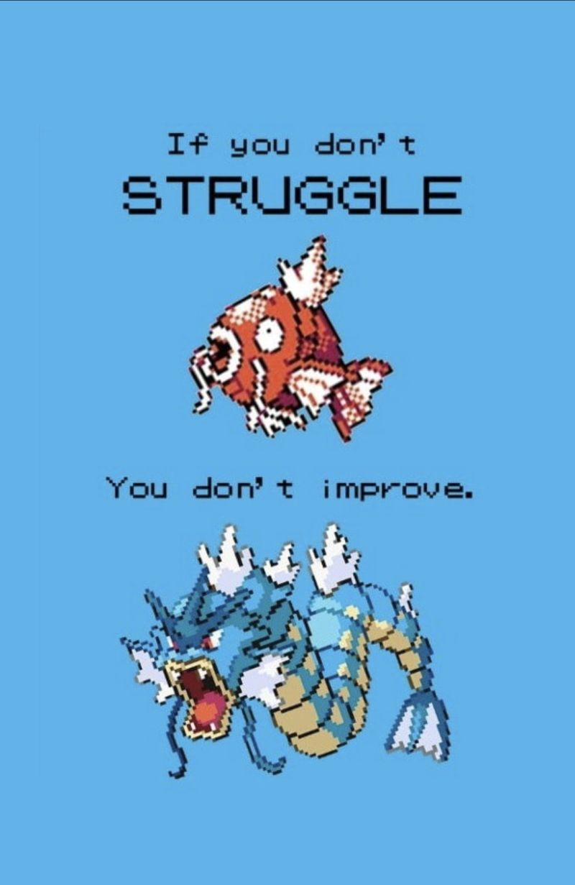

## Introduction about myself  

- a student that complated university studies related to cybersecurity 
- a CTF player
- learnt cybersecurity for a few years but still weak in it

## How I learn ethical hacking

### Part 0
Back then, I don't really know about red team and blue team and I just decided to learn hacking for fun. Since hacking others looks more fun, I decided to look into videos and anything related. The first courses I go through is actually Practical Ethical Hacking from TCM Security. After going through the first few topic of the course, I have some basic understanding about how hacking works (that's what I thought back then). Eventually, I stopped the course halfway because the course started to go through hackthebox retired machine and I don't have a VIP account to follow along. Instead, I decided to move on with PicoCTF and Tryhackme as some of the people mentioned this 2 platform is great for learning cybersecurity. I further improved my basic skills such as linux command and getting more new knowledge from Tryhackme since it has a lot of different room. As for PicoCTF, I was stunned for quite some times as that is the first time I find out about CTF. That is also when I found out that there are a lot of different hacking. 

### Part 1
I just keep playing with these 2 platform for quite some times until I found out some other interesting stuff, which is certification. One of the most popular cert is OSCP, which is commonly discussed by people. Although I don't have the money to get the certification, I noticed that a lot of people just talked about TJ Null list when discussing about OSCP. After searching about TJ Null list, it is a list of recommended boxes for people to play around for preparing OSCP. Since some of the boxes are free from vulnhub, I just play around some of it and learn some interesting knowledge. Aside of that, I started to participate some CTF competition online as a solo player and also play around with PwnTillDawn. As for hackthebox, I never touched any of the machines as I tried once and I dont know how to proceed with it. So I just run away and go to other platform. That's how I started for the first 2 years. 

### Part 2
Here's the part two where I started to approach people and play together. This whole thing started just because I attended a camp called Malaysia Cybersecurity Camp (MCC). I would say MCC change the way I understand cybersecurity and working alone is never gonna bring me to anywhere. Aside from that, learning together seems to be more fun and it is also easier to learn since there are a lot of pro in MCC. After this camp, I started to play around with people that have the same interest and a lot of fun stuff happened.

## Suggestion for people that wanted to get invole into cybersecurity

- remember to take notes 
- get some friends that have the same interest and learn together 
- just keep learning

